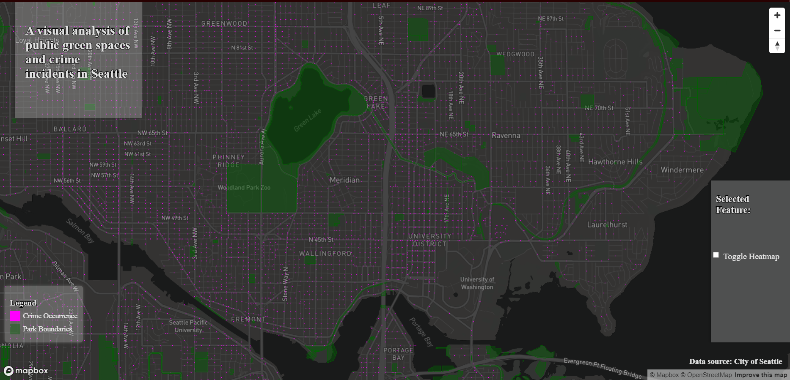
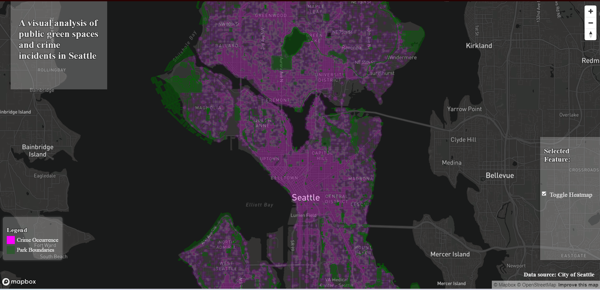

# Seattle's distribution of crime incidents in relation to green spaces.

## Members: 
- Abdirahim Mohamed-Nur Mohamed
- Andres Rovalo
- Dustin Duc Duy Nguyen
- John Duffy

---

## Project Description:
For our final project, we wanted to direct our focus to the topic of urban development and its relation to crime, specifically the distribution of crime incidents in the City of Seattle and their proximity to public green spaces. Our goal was to create an interactive web map that allows the user to hover throughout the city and across scales to better understand the relationship between crime and green urban spaces. By highlighting areas of currently existing public green spaces (Volunteer Park, Ravenna Park, Golden Gardens , etc.) and incorporating features such as a heat map and a bounding box function, we hope to provide the basis for a more comprehensive study of urban planning and the role that these public spaces have on the population and neighborhoods.

## Project Objectives:
The objective of the project is to better describe and observe the effect that public green spaces have on the distribution and type of criminal activity in urban spaces. Whether green spaces become hotspots of criminal activity or rather alleviate neighborhoods from such. The project takes into account the complexity of the phenomenon of crime, so rather than trying to provide an all-encompassing explanation for such, we will try to further develop the discourse by providing a more nuanced approach; taking into account public recreational space. By analyzing how these public spaces can play into crime in the Seattle area, we aim to find correlations that can reduce the harm caused by crimes, especially violent ones. If a greater amount of publicly accessible green spaces results in a smaller amount of crime in that area, it becomes clear that there needs to be a prioritization of developing these types of spaces, especially in the more crime ridden areas of Seattle.

## Application URL:
[Our Project](https://shankaraa2001.github.io/GEOG328_final_project/index.html)

## Screenshots:
 This is the standard view of our map. Each pink dot represents a crime located down to its city block location. Each green area represents a publicly accessible green space.

 This is the heat map view of our project. This view takes each crime and fills based on the density of crimes in a specific area. This is very useful when analyzing things on a much greater scale than just a singular park or few city blocks. This function allows for analysis of entire neighborhoods, without losing any clarity or insight. 

## Main Functions:
Heatmap - The addition of the heat map function was very important for the objectives of our project. By enabling a heat map, focus can be shifted towards the larger pattern of crime and where it is taking place, rather than simply the point data of singular crimes. With the heat map enabled, there is greater insight available on a larger scale. This will be more useful for gaining information for a neighborhood and multiple green spaces, rather than a smaller scale of one to two green spaces.

Descriptive Sidebar - This function was imperative to the project's goal of using this map to better understand the relationship between publicly accessible green spaces and crime throughout Seattle. This function allows the user to select any of the highlighted green spaces on the map and learn the name of this park. This function is great for local residents who know the area they are searhcing for very well. Being able to pin point specfic parks and areas will be extremely valuable to any user.

## Applied Libraries
The primary libraries that were applied was the Mapbox GL JS and Mapbox GL Draw. Through these libraries, we were able to create a very visually appealing map that is extremely responsive to user input. We also made great use of git, sharing all of our work and coding with each other in a neat and orderly fashion.

## Data Sources:
[Seattle Parks and Recreation Production](https://data-seattlecitygis.opendata.arcgis.com/datasets/SeattleCityGIS::parks/explore?location=47.658124%2C-122.307898%2C11.61)
This data set was responsible for all of the green space data in our map of the Seattle area

[Crime Rate in Top 10 Most Populated in Seattle](https://data.seattle.gov/Public-Safety/Crime-Rate-In-Top-10-Most-Populated-Areas-In-Seatt/f6cr-gwvc)
This data set was responsible for all of the point crime data that was used in this visualization. Data was only given down to the city block, allowing for a great amount of insight into crime locations.

## Acknowledgments

https://seattlecitygis.maps.arcgis.com/apps/MapSeries/index.html?appid=94c31b66facc438b95d95a6cb6a0ff2e 

https://seattlegreenspaces.org/ 

https://www.cdc.gov/pcd/issues/2020/19_0434.htm  